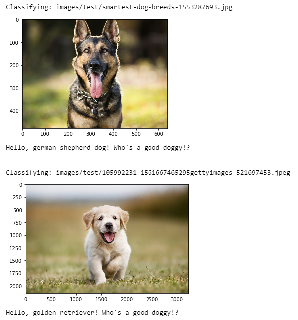

# Dog Breed Classifier

### Overview

A dog breed classifier built using transfer learning on pre-trained PyTorch [VGG16](https://pytorch.org/docs/stable/_modules/torchvision/models/vgg.html) and [ResNet50](https://pytorch.org/hub/pytorch_vision_resnet/) convolutional neural networks (CNNs).

### Jupyter Notebook

See the Jupyter notebook here: [dog_breed_detector_cnn.ipynb](dog_breed_detector_cnn.ipynb).

### Results

The model achieved ~67% classification accuracy after training on a small dataset over 20 epochs.

### References

This exercise was part of the [Udacity Deep Learning / ML nanodegree](https://www.udacity.com/course/deep-learning-nanodegree--nd101).
